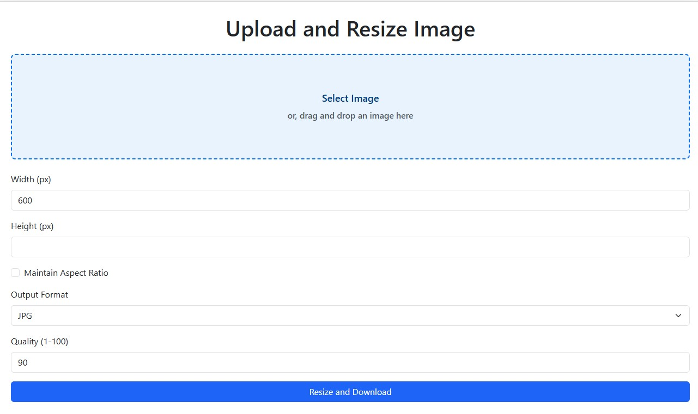

# Simple Image Resizer Django

This is a simple image resizer application built with Django.

## Features

- Upload images
- Resize images to specified dimensions
- Download resized images

## Installation

1. Clone the repository:

   ```bash
   git clone https://github.com/aouwalitshikkha/simple-image-resizer-django.git
   cd simple-image-resizer-django
   ```

2. Create a virtual environment and activate it:

   ```bash
   python -m venv venv
   source venv/bin/activate  # On Windows use `venv\Scripts\activate`
   ```

3. Install the required packages:

   ```bash
   pip install -r requirements.txt
   ```

4. Run the development server:

   ```bash
   python manage.py runserver
   ```

5. Open your browser and go to `http://127.0.0.1:8000/` to use the application.

## Usage

1. Upload an image using the upload form.
2. Specify the desired dimensions for the resized image.
3. Click the "Resize" button to resize the image.
4. Download the resized image.

## Screenshots



## Project Structure

- `simple_image_resizer/`: Main Django application directory.
- `templates/`: Contains HTML templates for the application.
- `static/`: Contains static files like CSS and JavaScript.
- `media/`: Directory where uploaded and resized images are stored.
- `requirements.txt`: List of Python packages required for the project.
- `manage.py`: Django's command-line utility for administrative tasks.

## Contributing

Contributions are welcome! Please open an issue or submit a pull request for any changes.

## License

This project is licensed under the MIT License. See the [LICENSE](LICENSE) file for details.
